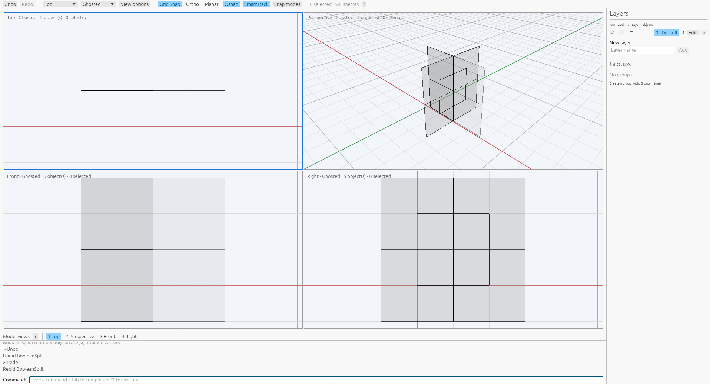

# BooleanSplit mixed coplanar stages

[Open targets](boolean-split-open-targets.md) · [BooleanSplit](commands/boolean-split.md)

Open planar targets now accept coplanar overlaps mixed with perpendicular sheets
and certified solid cutters. Cutter order is preserved. A coplanar stage records
actual boundary patches and their supporting faces, including shared patches,
remainders and holes. Later stages retain those physical boundaries alongside
their exact oriented region expressions. Geometry is exported only after all
stages; intermediate rounded B-reps never become operands.

On the captured rectangle, coplanar overlap followed by a perpendicular cut
creates three pieces; reversing the order creates two. An overlap contained in a
current planar face can produce a shared boundary and an open remainder. A patch
crossing a current outer boundary or only partly covering a hole is ignored.
A fully covered hole can produce a filled planar boundary. Solid stages may
join cutter walls to an open remainder. Duplicate physical boundaries in distinct
lineages are retained when the native command produces them.

Exact directed patch loops identify outer boundaries and holes. Coverage uses
original arrangement cells. Coplanar assignments retain the selected supporting
surface; noncoplanar stages carry existing physical patches and add only faces
from the current effective cutter. Future coplanar faces cannot enlarge the
original target. Region queries and boundary-patch work have explicit budgets,
and cumulative output limits remain in the Boolean plan. Document edits are
staged atomically, with source retention, attributes/groups, geometry user text,
idle selection and one Undo/Redo transaction.

Twenty owned public recipes ran on private Xvfb under
`VibocerosOracleBooleanSplitMixedOpenVerified20261007` with Rhino
8.32.26160.13001. All succeed and produce 56 pieces. The
[raw records](../tools/rhino_oracle/observations/boolean_split_mixed_open.json)
retain inputs, macros/events, output boundaries, face/edge counts, mass
properties, attributes, groups, geometry user text, idle snapshots and independent
Undo/Redo. Replay checks all outcomes, bidirectional boundary witnesses at
`1e-7`, scalar fields at `1e-9`, solid volume/centroid at `1e-10`, and metadata/history.
Order reversal, opposing normals, partial/full/disjoint overlaps, contained and
straddling patches, hole coverage, solid/sheet mixtures, preselection and retention
are measured. Kernel tests check order, surface ownership, ignored hole crossings
and source isolation. The app test checks both orderings, pending purity,
selection and one history entry. A fresh private-Xvfb inspection through the
production wgpu/egui app confirms viewport target picking, typed ordered cutters,
three pieces with both original cutters retained, idle selection and Undo/Redo.
The local image records that result after Redo in Ghosted mode; it does not compare
native pixels. See [provenance](boolean-split-mixed-open-provenance.json).



Native insertion order still differs. General curved/nonplanar geometry,
higher-degree support surfaces, arbitrary trimmed-face topology, ambiguous
coplanar junctions, broader compound policies, near-contact tolerance and relative
performance remain unsupported or unverified. These captures prove the recorded
workflows, not arbitrary Boolean compatibility.

```sh
cargo test --release -p viboceros-command boolean_split_mixed_open
cargo test --release -p viboceros-geometry mixed_coplanar
cargo test --release --bin viboceros mixed_open_getter
python3 -m unittest tools.rhino_oracle.test_boolean_split_mixed_open
```
