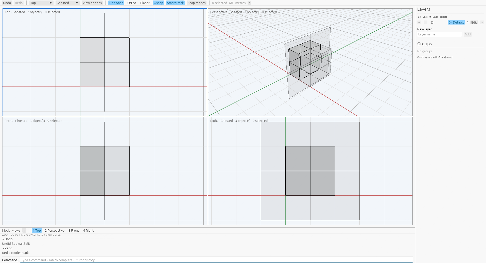

# BooleanSplit open planar targets

[BooleanSplit](commands/boolean-split.md) · [Finite cutters](boolean-split-plane-cutters.md) · [Oracle](oracle.md)

BooleanSplit accepts an open planar target with certified polyhedral solid
cutters or finite planar sheets. Target selection, DeleteInput, retained cutters,
attributes, groups, idle selection and Undo/Redo use the existing two-set workflow.
The target's orientation defines its half-space. Results contain the shared and
unshared boundaries of the target and cutters, including cutter faces.

A large plane target through a box produces a closed half-box and an open
remainder: the plane outside the box joined to walls from that same box half.
Reversing the target selects the opposite half. Two perpendicular plane sheets
produce bent two-face boundaries. Coplanar overlap creates one full target
boundary with the shared patch assigned to the cutter, plus the target remainder
with a hole. These results differ from splitting only the original target face.

Solid cutters require full finite target coverage of their plane section. Partial,
contained, disjoint and touching target/box inputs in the saved capture fail
without model or history edits. A finite sheet cutter must cover every positive-
length crossing on the current physical boundary. Coverage unions exact clipped
segment intervals over the actual sheet faces, rather than testing a midpoint.
Existing exact region masks retain cutter order; no rounded intermediate output
becomes a new operand. Open-target geometry user text is retained on every piece
in this capture, including disconnected shared solids.

The exporter distinguishes open boundaries from solid boundaries. The open path
assigns Boundary trims to naked edges, validates geometry and returns separate
edge-connected components. The existing solid path retains its closure and
manifold requirements. Supporting surfaces and original face ownership survive
export. Coplanar overlap uses physical arrangement cells with separate source
labels for the shared patch and remainder.

Sixteen owned public recipes ran on private Xvfb under
`VibocerosOracleBooleanSplitOpenPilot20261007` with Rhino 8.32.26160.13001.
Eleven succeed and create 27 pieces; five failures remain in the
[raw records](../tools/rhino_oracle/observations/boolean_split_open.json).
They retain source and result boundaries, face/edge counts, area, solid volume
and centroid where applicable, events, attributes, groups, geometry user text,
EndCommand/idle selection and independent Undo/Redo. Replay checks every outcome,
bidirectional boundary witnesses at `1e-7`, scalar fields at `1e-9`, solid
volume/centroid at `1e-10`, metadata and history. Open results are matched by
owner, area and bounds; native insertion order remains a known difference.
Kernel checks cover orientation, finite coverage, naked trims and isolation of
the closed-target contract. App checks cover source picking, closed/open output,
retention, preselection, cancellation and history. See
[provenance](boolean-split-open-provenance.json).

A fresh private-Xvfb inspection through the production wgpu/egui app confirms
surface-as-target viewport picking, retained box cutter, closed and open output,
unselected idle geometry and Undo/Redo. The local image below records the result
after Redo in Ghosted mode; it is not a native pixel comparison.



The supported targets are certified coplanar affine clamped bilinear faces with
straight trims. Curved or nonplanar targets and cutters and higher-degree support
surfaces remain unsupported. [Mixed coplanar stages](boolean-split-mixed-open.md)
now retain physical boundary patches through later solid and sheet cuts. Broader trimmed/compound policies, near-contact tolerance,
insertion/face ordering and relative performance remain unverified. Native
boundary witnesses are separate from the kernel's exact arrangement certificates.

```sh
cargo test --release -p viboceros-command boolean_split_open
cargo test --release -p viboceros-geometry open_target
cargo test --release --bin viboceros boolean_split_open
python3 -m unittest tools.rhino_oracle.test_boolean_split_open
```
