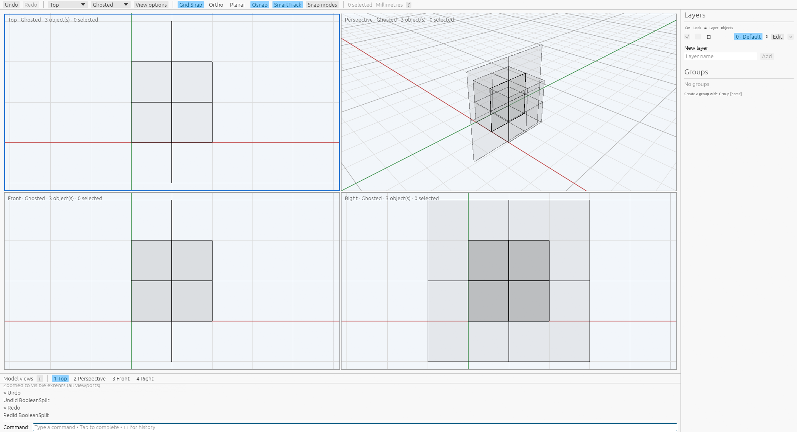

# BooleanSplit finite plane cutters

[BooleanSplit](commands/boolean-split.md) · [Polyhedral kernel](polyhedral-booleans.md) · [Oracle](oracle.md)

BooleanSplit now accepts finite planar NURBS surfaces and open planar B-rep
sheets as cutters for closed polyhedral targets. Pick them in the existing cutter
phase or supply their IDs in SecondSet. The new cap faces retain the cutters'
underlying surfaces. Target attributes, groups and geometry-user-text lineage,
source retention, idle selection and Undo/Redo use the existing command policy.

A sheet must cover the whole section of the current connected piece. A sheet
ending inside the piece does not become an infinite plane. Incomplete, internal,
touching and disjoint sheets leave the target unsplit. Coplanar sheets can jointly
cover a section; their separate face ownership remains in the caps. A gap in
that combined coverage prevents the split.

Order matters. On the captured cube, a half-sheet followed by a complete
perpendicular sheet produces two pieces. Reversing the order produces three:
the complete sheet first creates a smaller piece which the half-sheet can cut.
Solid cutters and plane sheets may be mixed, retaining every effective interface
and the measured geometry-user-text distinction between connected and
disconnected descendants.

The kernel shares strict affine-face, straight-edge and whole trim/model
correspondence certificates between closed operands and sheets. Closed inputs
still require their original embedded-shell certificate. Sheet faces must be
coplanar affine clamped bilinear patches with certified straight trim boundaries.
Planning rectangles span the target's projected bounds; cells record whether an
actual sheet covers them. Uncovered planning cells cannot supply result faces.
Exact coverage queries run separately for each current region. Coplanar sheets
form one stage at their first occurrence in the cutter list.

The reusable Boolean plan now queries connected material regions before export.
Inward cavity shells stay with their enclosing body; nested islands become
separate regions. All split, coverage, component and ancestry queries use one
original arrangement. Cartesian and UV values are rounded only when final
geometry is exported. Work, rational sizes and cumulative output bounds remain
explicit; any failure precedes document edits.

Nineteen public command recipes ran on private Xvfb in settings scheme
`VibocerosOracleBooleanSplitPlanesPilot20261007` with Rhino 8.32.26160.13001.
Fourteen succeed and produce 39 pieces; five no-split failures remain in the
[raw records](../tools/rhino_oracle/observations/boolean_split_plane.json).
The capture includes source and result boundaries, face/edge counts, mass
properties, command events, attributes, groups, geometry user text, EndCommand
and completed idle snapshots, and independent Undo/Redo. Command replay checks
all outcomes, bidirectional boundary witnesses at `1e-7`, scalar fields at
`1e-9`, volume/centroid at `1e-10`, metadata, immutable cutter snapshots and
history. Axis-aligned and diagonal cuts, normal reversal, exact extents, partial
and joint coverage, cutter order, mixed solid/surface inputs, preselection and
retention are represented. Kernel tests additionally check source-face ownership,
normal-relative side reports, cavity/island separation, limits and rejected
warped sheets. App tests cover both NURBS surface and B-rep inputs, pending source
purity, confirmation, partial-sheet failure and Undo/Redo. See
[provenance](boolean-split-plane-provenance.json).

A fresh private-Xvfb inspection of the production wgpu/egui app confirms target
and surface picking, acceptance with two closed pieces and the retained original
NURBS sheet, unselected idle output, and Undo/Redo. This local image records the
scene after Redo in Ghosted mode; it does not compare native pixels.



Curved and nonplanar sheets, higher-degree supporting surfaces and open targets
remain unsupported. Native insertion order, broader trimmed-sheet and compound
command policies, near-contact tolerance decisions, coplanar groups interleaved
with other cutters, and relative performance need further evidence. The exact
kernel certificates are separate from the saved native boundary-witness checks;
these records do not prove arbitrary-geometry or pixel-style parity.

```sh
cargo test --release -p viboceros-geometry surface_split
cargo test --release -p viboceros-command boolean_split_plane
cargo test --release --bin viboceros boolean_split_plane
python3 -m unittest tools.rhino_oracle.test_boolean_split_plane
```
