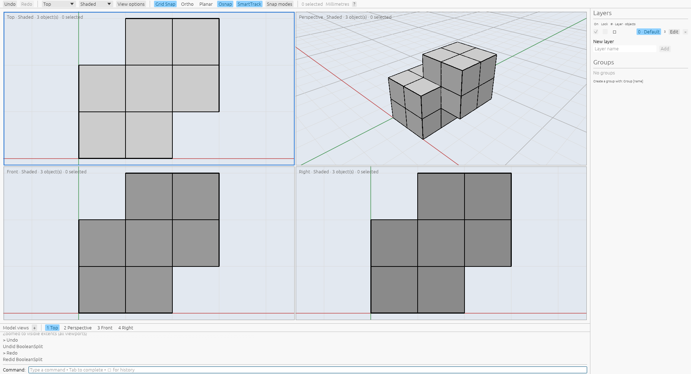

# BooleanSplit

[Command reference](README.md) · [Rhino reference](https://docs.mcneel.com/rhino/8/help/en-us/commands/booleanunion.htm#BooleanSplit)

Start `BooleanSplit`, select target surfaces or polysurfaces, and press Enter.
Select cutters and press Enter again. A preselected target set starts at the
cutter phase. Both phases accept viewport clicks, windows, object IDs, SelAll
and SelNone. The same object may occur in both sets; it does not cut itself.
An empty cutter set requests another selection. Escape or Cancel leaves the
model and history unchanged and releases selection.

`DeleteInput=Yes|No` is available in both getters. Yes deletes successfully split
targets; No retains them. Cutters always remain. Targets which no cutter splits
retain their original identity. The option defaults to Yes in a fresh command
registry and remembers accepted changes, including changes followed by cancellation.
Undo/Redo do not reset it. Preferences currently last for the application session.

Every output inherits its target's attributes, layer and groups. Geometry user
text follows the measured connected-region lineage: a single connected child
retains it, while all children of a disconnected branch lose it. Later cuts keep
that distinction. Attribute user text is always copied. Starting the command
before picking targets leaves the new pieces unselected; preselection selects
them. Retained sources are unselected when the command returns to idle. Native
EndCommand snapshots still have selected cutters; the saved idle snapshots show
their release. Undo restores the original objects unselected; Redo restores the pieces with their captured
selection and leaves retained source objects unselected.

For scripts, supply explicit object sets:

```text
BooleanSplit FirstSet=<target-id> SecondSet=<cutter-id> DeleteInput=Yes
BooleanSplit FirstSet=<target-id>,<other-target-id> SecondSet=<cutter-id>,<other-cutter-id>
```

Replace placeholders with object UUIDs. Explicit application scripts use the
preselection result policy; the Python/Rust command harness also exposes
command-first execution for native workflow comparisons.

[Finite plane cutters](../boolean-split-plane-cutters.md) also support complete,
partial and joint coverage queries, mixed cutters and preserved cap surfaces.
The target kernel accepts certified closed polyhedral B-reps, including concave
planar faces, holes, cavity shells and disjoint shells. All cutters in a target's
partition share one exact arrangement of original faces. Overlapping cutter
boundaries remain interfaces between separate pieces. Intermediate region
classification uses exact membership; rounded intermediate geometry never becomes
an operand. Connected-branch counts share that arrangement for metadata handling.
Bounded work, rational sizes and output face counts produce explicit failures.
All outputs are staged before document edits.

Strict containment, equality, disjoint sources and pure face/edge/point contact
produce no command split. A strictly internal cutter is ignored even when another
cutter splits the target. This differs from the mathematical partition API, which
can partition a target around an enclosed solid and retain the resulting cavity.

A private-Xvfb capture ran 28 public command recipes with Rhino 8.32.26160.13001
under `VibocerosOracleBooleanSplitVerified20261007`. Seventeen commands succeed;
eight no-split failures and three cancellations remain in the
[raw records](../../tools/rhino_oracle/observations/boolean_split_command.json).
Two follow-ups establish option persistence after cancellation in either getter.
The main successful commands create 64 pieces. Saved records include source
vertices and face loops, commands and events, area/volume/centroid, attributes,
geometry user text, groups, selection and independent Undo/Redo. Command replay
checks completed idle states, scalar fields within `1e-9` (volume/centroid within
`1e-10`), face/edge counts, boundary witnesses in both directions at `1e-7`, and
metadata/history. Kernel regressions
check all crossed-cutter regions, original-face ownership, nested material,
concave faces, holes, cavities, disjoint shells and volume conservation. App tests
cover both selection phases, preselection, retention, shared sets, cancellation
and history. A fresh private-Xvfb inspection of the production wgpu/egui app
confirms both viewport selection phases, acceptance with two new pieces and one
retained cutter, unselected idle output, and Undo/Redo. The image records that
scene after Redo in Shaded mode; it is a local UI inspection, not a native pixel
comparison. See [provenance](../boolean-split-provenance.json).



[Trimmed sheets and compound inputs](../boolean-split-topology.md) have separate
outer-coverage, branch-lineage and participating-shell policies.
[Open planar targets](../boolean-split-open-targets.md) produce shared and unshared
boundaries containing target and cutter faces. Curved and nonplanar inputs remain
unsupported. Object insertion order
differs from the captured native order; replays match pieces by owner and centroid
without hiding that difference. General native face/edge ordering, tolerance
contacts, compound command policies and relative performance remain unverified.
Reactive Rhino History is not implemented.

```sh
cargo test --release -p viboceros-geometry split_polyhedral
cargo test --release -p viboceros-command boolean_split
cargo test --release --bin viboceros boolean_split
python3 -m unittest tools.rhino_oracle.test_boolean_split
```
