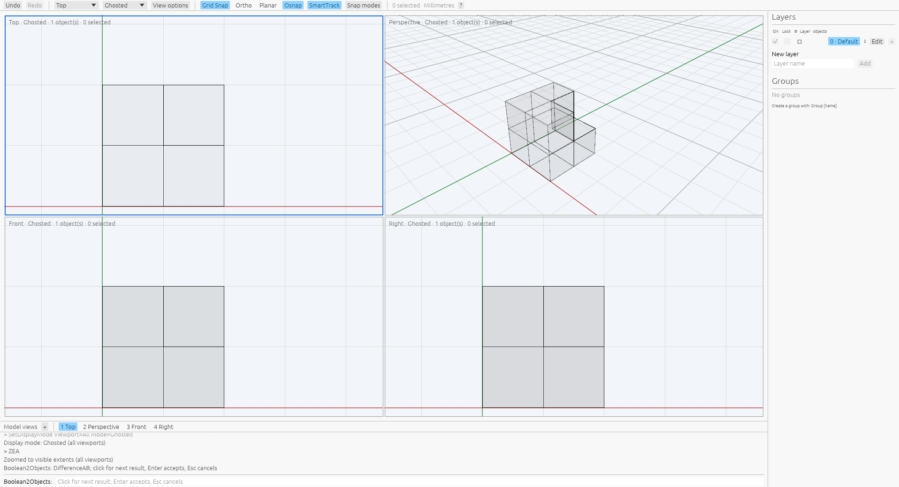
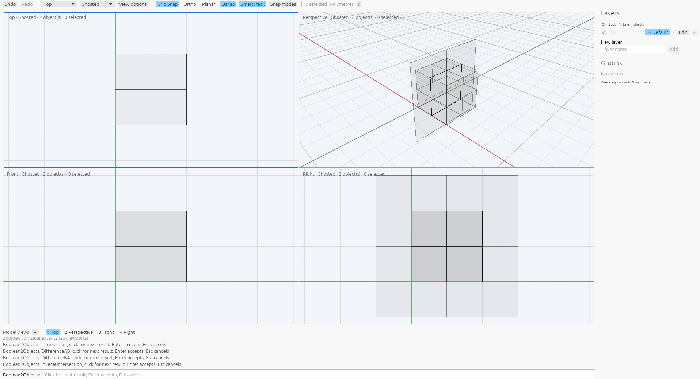
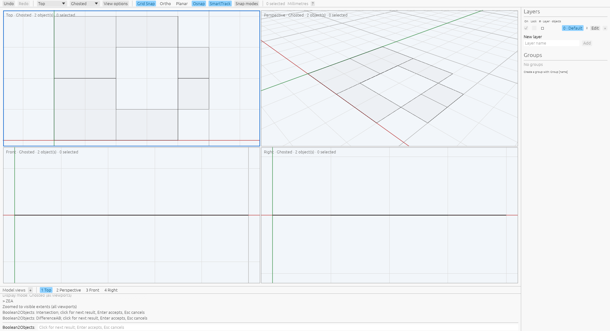
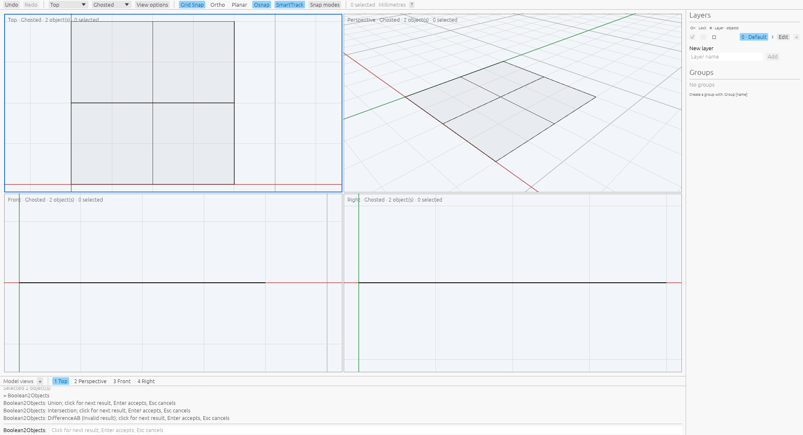

# Boolean2Objects

[Command reference](README.md) · [Rhino reference](https://docs.mcneel.com/rhino/8/help/en-us/commands/booleanunion.htm#Boolean2Objects)

Select two supported surfaces or polysurfaces and run `Boolean2Objects`, or start
the command, pick the objects and press Enter. The pending Union result appears
in every viewport. Click in a viewport or type Next to cycle:

```text
Union → Intersection → A−B → B−A → Inverse intersection → Union
```

Enter accepts the shown result; Escape or Cancel restores the original scene
without edits or history. A and B follow source selection order. Source geometry
and history remain untouched while cycling; source picks are released when the
preview starts. Preview scenes and prepared choices are reused on wraparound;
Wireframe, Shaded and Ghosted share the result.
Changed, hidden or locked sources or a changed tolerance cancel the stale preview.

DeleteInput defaults to Yes and can be set during source selection. Yes replaces
the first object in place and removes the second. B−A also retains the first
object's identity and attributes. Inverse intersection replaces that first object
with B−A and adds A−B. No retains both originals and creates new output. All pieces
inherit the first object's layer, attributes and groups. Geometry user text
survives single-component branches; multi-component uncut or coplanar branches
clear it.
Results are unselected. One Undo restores the original pair; Redo restores the
accepted result. Option changes persist for the current registry session.
The app also accepts DeleteInput changes while cycling as an extension.

Scripts can select two objects and use Mode=Union, Intersection, DifferenceAB,
DifferenceBA or InverseIntersection to accept directly, or supply Sources=id,id:

```text
Boolean2Objects Mode=Intersection DeleteInput=No
Boolean2Objects Sources=<a-id>,<b-id> Mode=InverseIntersection
```

The current kernel accepts certified closed polyhedral B-reps and affine planar
sheets with linear trims. All five choices share one exact original-face
arrangement; no rounded result becomes an operand.
Source-face seams remain distinct. Preparation has bounded work and cumulative
output limits. Disjoint and strictly contained closed-solid pairs fail without
edits. A sheet crossing a solid must cover the complete physical section; partial
crossings fail. Uncut sheets remain in every mode, closed inputs are dropped,
and inverse intersection duplicates the uncut result. Coplanar sheets retain
trim seams; agreeing normals use the common/exclusive partition for Union and
Intersection, and both exclusive regions for either Difference. Opposing normals
swap these choices. Inverse intersection duplicates the Difference branch.
Equal sheets and connected edge contacts can show an Invalid result; Enter
preserves both originals and creates an unchanged Undo step, matching Rhino.
Geometry acceptance still rejects empty pieces outside that explicit path.

Eleven owned public recipes ran on private Xvfb under
`VibocerosOracleBooleanTwoVerified20261007` with Rhino 8.32.26160.13001. Seven
succeed, one cancels and three fail before cycling. The
[raw records](../../tools/rhino_oracle/observations/boolean_two_command.json)
retain real bounded mouse sequences, prompts and cycle labels, final boundaries,
counts, mass properties, metadata, IDs, selection and independent Undo/Redo.
Replay checks every completed outcome, boundary witnesses in both directions at
`1e-7`, scalars at `1e-9`, volume/centroid at `1e-10`, identity, metadata and history.
The app replay covers original cycle counts, cancellation, failed preparation,
source purity and history; cache/stale-source tests check reuse and invalidation.
See [provenance](../boolean-two-provenance.json).

The [planar/open follow-up](../boolean-two-open-provenance.json) adds 48 public
recipes from two private Xvfb sessions: 46 successes, one partial-crossing failure
and one cancellation. [Combined replay](../../tools/rhino_oracle/observations/boolean_two_open.json)
retains every record, with unchanged raw sessions linked in provenance. It checks
all five modes for plane/box in both orders, reversed normals, perpendicular
sheets, nested coplanar sheets, contained/disjoint sheets and parallel sheets,
plus retention and cancellation. Command replay compares boundaries, counts,
mass, identity, metadata and independent history at the same epsilons above.
App replay checks original click counts, untouched source geometry/history,
acceptance and Undo/Redo. Independent kernel tests check finite coverage,
normal-relative volume, coplanar area/hole preservation and plan isolation.

The [coplanar follow-up](../boolean-two-coplanar-provenance.json) records 37
additional public recipes under `VibocerosOracleBooleanTwoCoplanarVerified20261007`:
36 successes and one cancellation. [Complete records](../../tools/rhino_oracle/observations/boolean_two_coplanar.json)
cover all five modes for partial overlap, reversed normals, smaller-first nested
sheets, equality, opposite equality, disjoint sheets and edge contact, plus
retention and cancellation. Common/exclusive patch categories remain separate
from supporting-face lineage so merging preserves shared trim seams. Replays
compare complete geometry, topology, metadata, identity and Undo/Redo; the app
replay checks original click counts and untouched source geometry/history.
Independent tests cover exact partial-area queries, category labels, work/output
limits and rollback of explicitly accepted unchanged history.

A production wgpu/egui inspection on private Xvfb checked viewport source picks,
click cycling, Escape, Enter acceptance, Undo/Redo and display-mode changes during
the pending command. The saved Ghosted view shows A−B with one preview object
while the actual layer pane still counts the two unchanged source objects.
This local inspection does not measure native preview pixel parity.



A fresh private-Xvfb inspection of the planar extension also checks a typed
SrfPt/Box pair, preselection, four real cycle clicks, Enter, Undo and Redo.
Its inverse preview contains a closed half-box plus an open boundary, rendered
through the same production Ghosted path.



A fresh private-Xvfb production inspection checks partial-overlap Difference
with both exclusive pieces, Enter and Undo/Redo, then identical-sheet Invalid
result acceptance and its independent Undo/Redo. These are local renderer checks,
not native pending-pixel comparisons.





Curved sources, nonplanar open polysurfaces, arbitrary compound policies,
trimmed-hole coplanar combinations, near contacts, restart option persistence,
native preview pixels and relative performance remain unsupported
or unverified. The native driver records final command geometry, not the
proprietary display-conduit geometry at each pending click.

```sh
cargo test --release -p viboceros-command boolean_two
cargo test --release --bin viboceros boolean_two
python3 -m unittest tools.rhino_oracle.test_boolean_two tools.rhino_oracle.test_boolean_two_open tools.rhino_oracle.test_boolean_two_coplanar
```
