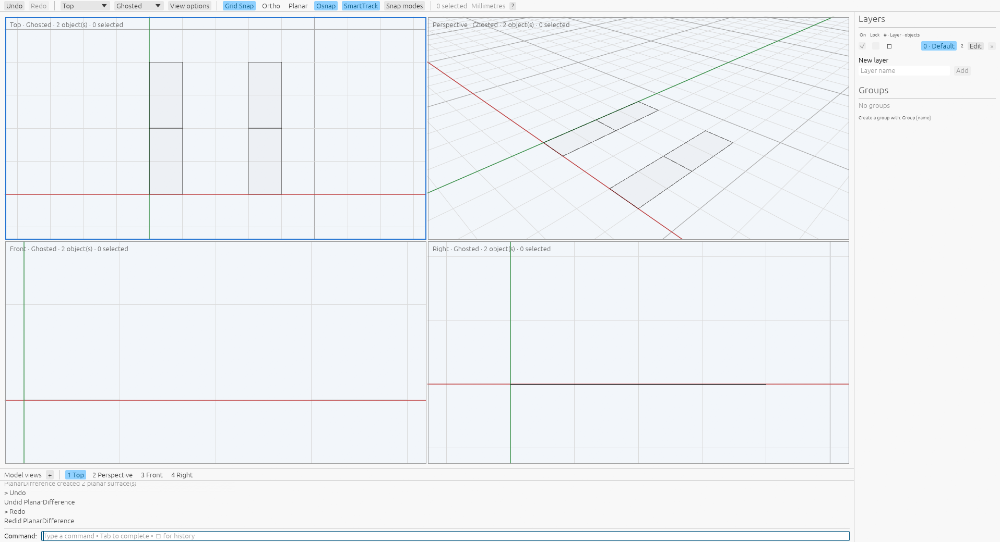
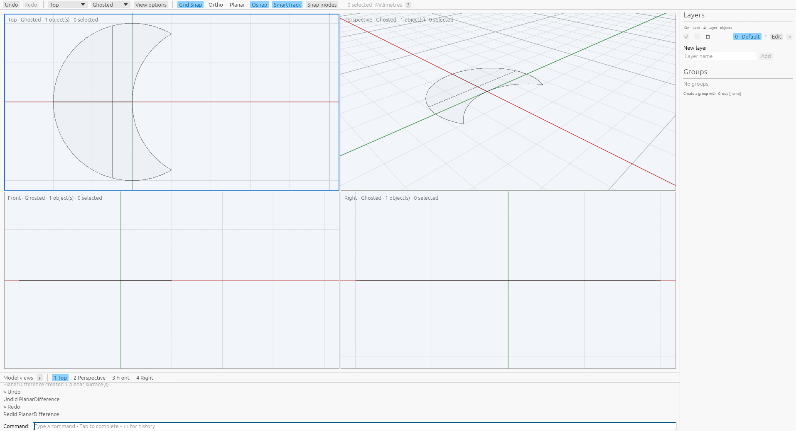

# Planar surface Booleans

[Command reference](README.md) · [Rhino reference](https://docs.mcneel.com/rhino/8/help/en-us/commands/booleanunion.htm#PlanarUnion)

`PlanarUnion` merges selected planar surfaces into finite-area regions. Start the
command, select at least two surfaces and press Enter, or preselect them before
running it. Disjoint regions produce separate surfaces. `PlanarDifference` asks
for one source surface and then one cutter; it completes on the second pick.
`PlanarIntersection` completes after two picks or with two preselected surfaces.
Escape cancels pending picks. Difference requires fresh picks even when objects
were preselected, following the native getter.

Scripts can specify ordered object IDs directly:

```text
PlanarUnion Sources=<a>,<b>,<c>
PlanarDifference Sources=<a>,<b>
PlanarIntersection Sources=<a>,<b>
```

The polygon path accepts affine planar surfaces with certified linear trims,
including outer boundaries and holes. A separate circular path accepts complete
circular disks in parallel planes. Original boundary polygons are projected
orthogonally onto the first surface's plane with exact rational arithmetic before
the finite-area arrangement. Tilted and parallel offset inputs are supported;
perpendicular inputs collapse to zero area. Normals do not change set membership.
Every operation uses original physical patches, excluding virtual planning
rectangles. Union
merges all selected inputs; Difference subtracts B from A; Intersection retains
their shared area. Coplanar merging removes interior partition seams. The kernel
bounds input, fragment, rational, work and output sizes. Intermediate
projected B-reps are never rounded and reused as operands. The first affine
support is extended for final output only; trims and topology remain validated
at the document tolerance.

Circular inputs undergo whole-span circular-locus and simple-loop certification.
Their boundaries are classified as analytic arcs, assembled into outer/hole loops
and exported as rational NURBS. Original circular seams remain distinct.
Parallel offset disks project onto the first plane without changing radius;
nonparallel disks become ellipses and are not yet accepted. Circular control,
arc and graph work limits bound preparation. Signed loop contributions use exact
accumulation of finite terms.

Union and Difference delete their sources and create new default-attribute
surfaces on the current layer, without source groups or geometry user text.
Intersection replaces the first source in place and deletes the second; its
attributes and groups survive while geometry user text is cleared. Empty
Difference and Intersection results succeed and delete both inputs. Results are
unselected. Undo restores the original objects and metadata; preselected Union
and Intersection picks return selected on Undo, while command-first picks and
Difference picks remain unselected. Redo restores the accepted result unselected.
Each successful command owns one transaction.

The [complete native capture](../../tools/rhino_oracle/observations/planar_boolean_command.json)
contains 28 successful public recipes on private Xvfb under
`VibocerosOraclePlanarBooleanCorrected20261007`, using Rhino 8.32.26160.13001.
It measures overlap, reversed normals, containment in either order, equality,
disjoint and touching regions, parallel offset planes, three-surface Union and
preselection. Command replay checks boundaries in both directions at `1e-7`,
scalars at `1e-9`, identity, attributes/groups, geometry user text and independent
Undo/Redo. App replay checks ordered picking, set confirmation, preselection,
cancellation, topology, area and history. Independent kernel tests cover multiple
original operands, finite-area set rules, opposite normals and work/output limits.
See [provenance](../planar-boolean-provenance.json).

The [trim-hole/projection follow-up](../planar-boolean-topology-provenance.json)
adds 31 successful public recipes under `VibocerosOraclePlanarTopologyVerified20261007`.
[Complete records](../../tools/rhino_oracle/observations/planar_boolean_topology.json)
cover hole filling, cover/straddle/cut regions, holed cutters, two different hole
boundaries, tilted inputs and reversed normals, a tilted first support,
perpendicular collapse and multi-input hole filling. Command replay checks every
boundary, topology count, area, identity, metadata and independent history at the
same tolerances above. App replay checks all source-picking phases and history.
Independent kernel tests compare both projection orders and collapsed area,
verify all output vertices lie on the first plane, reject warped/oversized inputs
and confirm original sources remain unchanged.

The [circular follow-up](../planar-boolean-circular-provenance.json) retains 28
successful native recipes under `VibocerosOraclePlanarCircularVerified20261007`.
[Full NURBS edge definitions and samples](../../tools/rhino_oracle/observations/planar_boolean_circular.json)
cover overlap, containment in either order, equality, disjoint/external/internal
tangency, reversed normals, parallel offsets and three-disk Union. All 28 local
outcomes replay identity, metadata and independent history; 26 also match native
topology and bidirectional finite curve witnesses at `5e-6`. Area comparisons use
`2e-5`, reflecting native mass integration and perturbed projected arcs.
Independent kernel checks retain analytic area at `1e-9` and circle loci at
`1e-12`. Earlier polygon tolerances remain unchanged.

Two internal-contact discrepancies remain explicit. Local Difference retains
exact point contact, while the native fitted boundary omits the contact point
with a reverse witness gap between `0.005` and `0.006` model units. Local
Intersection retains one complete circle edge; native creates three perturbed
edges (its curve witnesses remain within `5e-6`). The tests keep both records as
diagnostics; these cases do not establish native parity.

A production wgpu/egui inspection on private Xvfb checks ordered viewport picks
for Difference and Intersection, automatic completion on the second pick, and
Undo/Redo in Ghosted mode. It also checks three-surface preselected Union.
The saved Difference result contains the first surface's unshared region.
This local inspection does not measure native pixel parity.


A fresh private-Xvfb inspection also creates a holed surface, then cuts it with
a tilted sheet using viewport picks in Ghosted mode. The projected Difference
produces two planar pieces; Undo restores the holed source and tilted cutter,
and Redo restores both pieces. The second getter excludes the first source before
hit ranking, allowing an enclosed cutter to be picked in filled views.



A circular production inspection on private Xvfb creates Circle/PlanarSrf disk
inputs, picks a Difference source/cutter, checks Undo/Redo in Ghosted mode and
runs preselected circular Union. The saved crescent retains rational arc edges;
this inspection does not compare native pixels.



General curved loops, mixed polygon/circular inputs, circular input holes,
nonparallel circular projections, compound surfaces, broader hole configurations,
near contacts, restart behavior and relative performance remain unsupported or
unverified. This capture does not establish
native preview pixel parity.

```sh
cargo test --release -p viboceros-command planar_boolean
cargo test --release --bin viboceros planar_boolean
python3 -m unittest tools.rhino_oracle.test_planar_boolean tools.rhino_oracle.test_planar_boolean_topology tools.rhino_oracle.test_planar_boolean_circular
```
