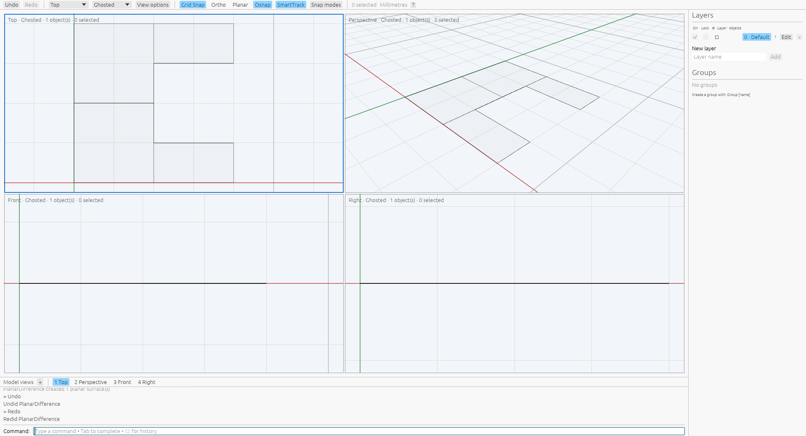

# Planar surface Booleans

[Command reference](README.md) · [Rhino reference](https://docs.mcneel.com/rhino/8/help/en-us/commands/booleanunion.htm#PlanarUnion)

`PlanarUnion` merges selected planar surfaces into finite-area regions. Start the
command, select at least two surfaces and press Enter, or preselect them before
running it. Disjoint regions produce separate surfaces. `PlanarDifference` asks
for one source surface and then one cutter; it completes on the second pick.
`PlanarIntersection` completes after two picks or with two preselected surfaces.
Escape cancels pending picks. Difference requires fresh picks even when objects
were preselected, following the native getter.

Scripts can specify ordered object IDs directly:

```text
PlanarUnion Sources=<a>,<b>,<c>
PlanarDifference Sources=<a>,<b>
PlanarIntersection Sources=<a>,<b>
```

Inputs currently require affine planar surfaces with linear trims. Parallel
offset planes are translated onto the first surface's plane before the exact
finite-area arrangement. Normals do not change set membership. Every operation
uses original physical patches, excluding virtual planning rectangles. Union
merges all selected inputs; Difference subtracts B from A; Intersection retains
their shared area. Coplanar merging removes interior partition seams. The kernel
bounds input, fragment, rational, work and cumulative output sizes.

Union and Difference delete their sources and create new default-attribute
surfaces on the current layer, without source groups or geometry user text.
Intersection replaces the first source in place and deletes the second; its
attributes and groups survive while geometry user text is cleared. Empty
Difference and Intersection results succeed and delete both inputs. Results are
unselected. Undo restores the original objects and metadata; preselected Union
and Intersection picks return selected on Undo, while command-first picks and
Difference picks remain unselected. Redo restores the accepted result unselected.
Each successful command owns one transaction.

The [complete native capture](../../tools/rhino_oracle/observations/planar_boolean_command.json)
contains 28 successful public recipes on private Xvfb under
`VibocerosOraclePlanarBooleanCorrected20261007`, using Rhino 8.32.26160.13001.
It measures overlap, reversed normals, containment in either order, equality,
disjoint and touching regions, parallel offset planes, three-surface Union and
preselection. Command replay checks boundaries in both directions at `1e-7`,
scalars at `1e-9`, identity, attributes/groups, geometry user text and independent
Undo/Redo. App replay checks ordered picking, set confirmation, preselection,
cancellation, topology, area and history. Independent kernel tests cover multiple
original operands, finite-area set rules, opposite normals and work/output limits.
See [provenance](../planar-boolean-provenance.json).

A production wgpu/egui inspection on private Xvfb checks ordered viewport picks
for Difference and Intersection, automatic completion on the second pick, and
Undo/Redo in Ghosted mode. It also checks three-surface preselected Union.
The saved Difference result contains the first surface's unshared region.
This local inspection does not measure native pixel parity.



Curved trim boundaries, nonparallel projections, compound surfaces, general
trimmed-hole combinations, near contacts, restart behavior and relative
performance remain unsupported or unverified. This capture does not establish
native preview pixel parity.

```sh
cargo test --release -p viboceros-command planar_boolean
cargo test --release --bin viboceros planar_boolean
python3 -m unittest tools.rhino_oracle.test_planar_boolean
```
