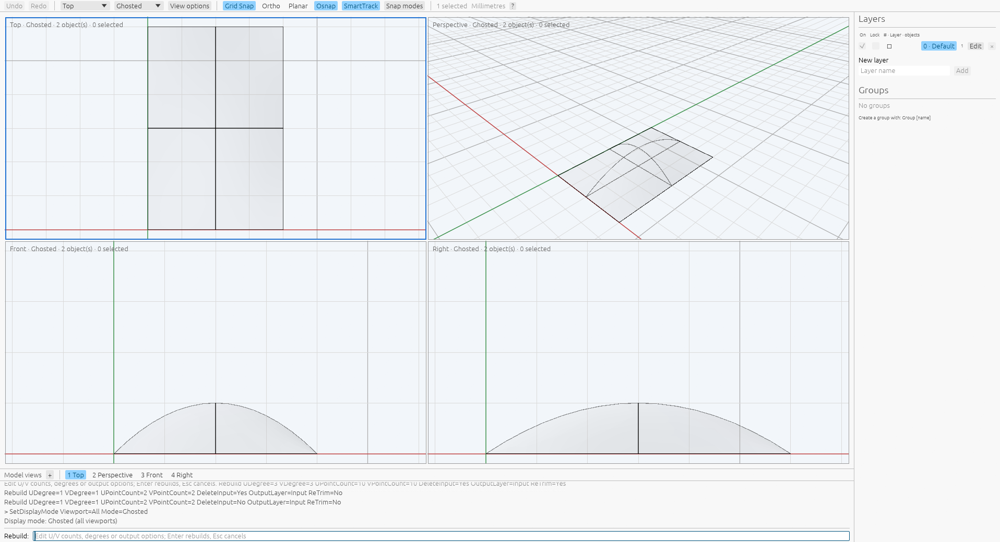

# Rebuild surfaces

[Command reference](README.md) · [Rhino reference](https://docs.mcneel.com/rhino/8/help/en-us/commands/rebuild.htm)

`Rebuild` reconstructs selected single-face surfaces with independent U/V degrees
and control counts. Curves retain their existing Rebuild options. With selected
surfaces, bare `Rebuild` opens an options prompt. Starting it without selection
asks for surfaces first; Enter then opens options. A complete inline invocation
accepts after picking, or runs directly on preselected surfaces.

```text
Rebuild UPointCount=5 VPointCount=4 UDegree=3 VDegree=2
Rebuild UPointCount=7 VPointCount=5 UDegree=3 VDegree=2 DeleteInput=No OutputLayer=Current ReTrim=No
```

Fresh defaults are 10 controls and degree 3 in each direction, `DeleteInput=Yes`,
`OutputLayer=Input` and `ReTrim=Yes`. Degrees accept 1 through 11; counts must
exceed their degree and are locally bounded at 256 per axis. Aggregate preparation
is limited to one million controls. Scripted degree increases raise the associated
count to at least `degree + 1`. A count below the current degree minimum is
rejected, retaining the count. Edits apply in token order, so lowering the degree
first can admit a later smaller count. This follows measured native script
getters; the native dialog's automatic degree lowering remains unimplemented.

At the options prompt, use `Name=value`, `Name value`, or an option name followed
by a value at the next prompt. Enter at a value prompt keeps the value and
returns to options. Enter in options accepts; Escape or Cancel ends the command.
Every valid edit is remembered immediately, including counts, degrees, deletion,
layer and ReTrim, and survives cancellation and Undo/Redo. Invalid edits change
neither preferences nor geometry. Preferences belong to the command registry,
are shared by its documents and reset in a new registry. Application restart
persistence and interaction with curve Rebuild preferences remain unverified.

The options phase shows a readonly viewport preview in Wireframe, Shaded and
Ghosted modes. Counts, degrees and ReTrim changes prepare new geometry; deletion
and output-layer changes reuse it. Unchanged edits and `Preview` retain the same
cached scene. Enter accepts those prepared surfaces in one transaction.
Invalid values keep the previous preview. A valid edit that fails preparation
clears the scene and blocks acceptance until a supported edit recovers.
Cancellation drops staged geometry while retaining the measured option memory.

Before edits or acceptance, source geometry, attributes, geometry-root text,
groups, selection, tolerance and current layer are revalidated. Stale sources
cancel the prompt before updating preferences or geometry. Unrelated object,
layer, group or grip-display changes refresh the background using prepared
geometry. Preview preparation preserves document history, including redo.

The shared kernel samples two midpoint isocurves by arc length, maps uniform
Greville fractions to their source parameters, evaluates a tensor grid and solves
two collocation systems. The result is non-rational with uniform unit-span knots.
Solves normalize coordinates and check pivots, finite controls and backward
residuals. This approximates the original surface; it does not certify continuous
locus preservation. Positive source weights are required.

Closed directions use uniform cyclic collocation: integer stations for odd
degrees and half-integer stations for even degrees, mapped by midpoint-isocurve
arc length. A requested count of `n` stores `n + degree` controls, with the final
degree controls repeating the first ones exactly. Degree-one output closes
geometrically without periodic classification. Open directions retain clamped
Greville interpolation. Periodic repetitions count toward the aggregate control
budget. Exact constant boundary isocurves remain exact poles after both solves.

Replacement retains source identity and copies its attributes, including name,
color and attribute user text. Output groups are cleared. `OutputLayer=Current`
moves a replacement or copy onto the current layer. Copying preserves the
original geometry and groups. Outputs finish unselected; one Undo restores the
originals and Redo restores the accepted objects. All geometry is prepared before
document edits.

`ReTrim=No` rebuilds a single face's full underlying surface with natural boundaries
and uniform output domains. When removing trims produces a solid, its output
orientation is normalized outward, including swapped/reversed sphere charts.
The exact solid-orientation classifier is tried first; an unresolved single
connected shell uses the signed-volume fallback shared by `Cap`. This numerical
fallback is not a certificate of a general solid's embedding. Open output faces
retain their source face sense. `ReTrim=Yes` transfers the original physical edges
onto the rebuilt surface and retains the source UV domains. Natural four-side
faces use exact target isocurves directly, following measured native behavior.
Their edge indices, vertex connectivity, reversed uses and face orientation are
retained. Holes and shared endpoint parameters are retained by physical projection.
This uses physical projection: copying normalized UV coordinates gives incorrect
boundaries when the source parameter speed changes.

The kernel tries a certified exact pullback first. Otherwise it fits bounded
closest-point projections in normalized UV, with a fit tolerance scaled by
polynomial derivative-control bounds. Projection searches and interpolation
error checks are sampled and do not prove a global closest point or continuous
projection error. New spatial edges have independent continuous certificates
against the new UV trims, and the assembled B-rep must pass ordinary validation.
Neither original spatial edges nor component tolerances are silently retained
when inconsistent with the rebuilt surface. Different native and local fitting
representations remain visible in the records.
Proven straight UV contour images use linear parameter speed to admit direct
tensor-knot composition. Constant-coordinate interpolation noise can be aligned
within the UV fit budget before exact-locus simplification; trim parameter speed
need not match the input edge's speed.

A complete constant-U contour spanning a closed V chart transfers to a target
isocurve at its projected shared endpoint U. Captured trim transfer keeps that
coordinate even when pointwise nearest surface parameters vary. The constant-V
contour on the normal sphere chart follows the preceding fitted projection path;
this measured native asymmetry remains explicit. A separate
[66-query closest-point capture](../../tools/rhino_oracle/observations/surface_rebuild_cap_projection.json)
shows a U range of about `0.000474` on the swapped cap, while the native transferred
trim's U control range is below `3e-8`. The isocurve rule follows native contour
transfer rather than claiming the pointwise closest locus. General contour and
chart families remain unverified.

Natural closed faces now support seam and singular trims when the target has
the same side incidence. Repeated seam edges, singular trims without edges,
vertex connectivity and face orientation are retained. The complete source UV
domains are restored with ReTrim; without it, domains follow the uniform rebuilt
span counts. Trimmed seam faces use a separate periodic lift for each trim use,
preserving U=0 and U=end even when both refer to one spatial vertex. Projection
continues from the original chart with bounded local refinement and global
fallback. Exact seam sides use one-dimensional isocurve projection. Generic
singular trims on exactly collapsed natural sides are also supported. A coherent
UV control hull must remain inside the original chart, and the complete target
boundary isocurve must have identical control positions. The pole retains its
vertex index and has no spatial edge. Each singular trim retains its own UV
interval, including partial sides on wedges. Adjacent edge uses retain separate
UV endpoints at the same pole; the collapsed coordinate is set exactly. Target
sides that lose their exact collapse, interior singularities and conflicting
pole incidence are rejected before document edits.

Polysurfaces, general interior singularities, rational target surfaces, mixed curve/surface batches,
native preview appearance, restart persistence and performance parity remain unresolved.
The earlier replacement capture contains no geometry-root user text, so its
replacement lifetime is not established by that evidence.

The [12-command capture](../../tools/rhino_oracle/observations/surface_rebuild.json)
ran on private Xvfb with polynomial/rational inputs and all copy/replacement and
input/current-layer combinations. It retains complete controls, 81 stations,
attributes/groups, source identity and independent history. Native command
definitions exactly equal their corresponding public Surface.Rebuild results.
Kernel and command replays use `1e-6` for positions and exact knots/weights.
A separate [12-query SDK capture](../../tools/rhino_oracle/observations/surface_rebuild_geometry.json)
checks additional reductions and asymmetric counts/degrees through the JSON API.
Its initial local audit exposed two rational endpoint-distance failures from a
one-step floating-point overshoot; endpoint parameters now use exact source
domain boundaries, with fractions formed before length multiplication.
The initial six wrong-option commands remain separate diagnostics. See
[provenance](../surface-rebuild-provenance.json) for producer and capture hashes.

The [25-step option capture](../../tools/rhino_oracle/observations/surface_rebuild_options.json)
and [nine-step ordered follow-up](../../tools/rhino_oracle/observations/surface_rebuild_option_followup.json)
ran under fresh private Xvfb settings schemes. Full native prompts distinguish
immediate memory, rejected counts and degree-driven count growth. App replay
checks every initial/final state, cancellations, accepted controls and independent
history. Separate regressions cover numeric value questions, unchanged invalid
edits, registry isolation and alias access. See
[option provenance](../surface-rebuild-options-provenance.json).

The [eight-case retrim capture](../../tools/rhino_oracle/observations/surface_rebuild_retrim.json)
and [six-case follow-up](../../tools/rhino_oracle/observations/surface_rebuild_retrim_followup.json)
ran on private Xvfb. They retain complete source/output B-reps, 33 stations per
edge, 81 surface stations and independent history for rectangular planar/warped
cuts, a planar hole, nonuniform control spacing, curved/rational sources and
natural boundaries. Every native retrim command equals public
`Brep.CreateTrimmedSurface`; the UV-copy candidate disagrees materially on the
nonuniform source. Local command replay compares target controls at `1e-6` and
native edge distance witnesses at `2e-6`, plus source purity and Undo/Redo.
The native circular hole has a fitted polynomial representation; local exact
rational representations are retained. An analytic offset-plane test checks
area, holes, orientation and all new trim/edge certificates. App testing checks
readonly option edits, accepted holes and history. See
[retrim provenance](../surface-rebuild-retrim-provenance.json).
The initial default 10×10 circular-hole regression exhausted the ordinary
knot-crossing certificate. A global affine control-net certificate now proves
that case continuously while retaining rational circle controls; it also rejects
incorrect translated images and mixed-sign UV proposals.

Four [default natural-face commands](../../tools/rhino_oracle/observations/surface_rebuild_natural.json)
extend the evidence to warped bilinear and curved quadratic inputs rebuilt to
10×10 degree-3 nets, with and without ReTrim. Their native outputs have four
linear UV contours and exact target isocurves. Command replay checks controls,
edge witnesses and independent history. Regressions cover source purity, cache
identity, output-policy reuse, stale events, failed-work recovery, registry
isolation and all twelve earlier native output variants.

A private-Xvfb inspection of the production egui/wgpu app completes eight stages:
source, shaded replacement preview, ghosted copy preview, invalid edit, acceptance,
Undo, Redo and cancellation. The copy preview draws two surfaces while the layer
pane still reports one document object. Raw screenshots/OCR and hashes are linked
in [preview provenance](../rebuild-preview-provenance.json). Early observers
misread active/invalid command text; the final observer waits on the command field
and completed successfully. This verifies the local workflow; native pixel
appearance and Rhino's manual Preview-button update cadence are not compared.



The [16-case closed capture](../../tools/rhino_oracle/observations/surface_rebuild_closed.json)
and [12-case degree/count follow-up](../../tools/rhino_oracle/observations/surface_rebuild_closed_degrees.json)
ran on fresh private Xvfb schemes. They retain spheres, cylinders, cones and
tori, transposed charts, a reversed sphere, closure/periodicity/singularity flags,
complete B-reps and independent history. Kernel replay checks public SDK control
nets at `1e-6`; command replay checks seam/pole topology and edge witnesses at
`2e-6`. Analytic tests check closed solids, exact repeated controls and source
purity in both charts; app tests check readonly preview, acceptance and history.
Initial discarded-return-value chart diagnostics are retained separately. See
[closed rebuild provenance](../closed-surface-rebuild-provenance.json).
Arbitrary periodic inputs, degenerate midpoint isocurves and performance parity
remain unverified. Closed-source TweenSurfaces matching retains its earlier
boundary and is not established by this Rebuild evidence.

The [eight cylinder trim recipes](../../tools/rhino_oracle/observations/surface_rebuild_seam_trim.json)
and [two seam-crossing hole recipes](../../tools/rhino_oracle/observations/surface_rebuild_crossing_hole.json)
ran under fresh private Xvfb schemes. ReTrim outcomes exactly equal public
`Brep.CreateTrimmedSurface` records for a ring patch, interior rectangle, interior
hole, seam-side half-cylinder and a hole cut across the seam. Complete topology,
controls, edge stations, source purity and independent history are retained.
Local replay checks target controls at `1e-6`, scaled knots at `1e-12`, shared seam
incidence and bidirectional boundary witnesses at `2e-6`.

Periodic projection fits a compact parameter basis while checking every original
trim span at extra stations. It avoids forcing all old source knots into the new
basis. Full natural boundary edges can be reused on a face with holes. When an
unshared contour exceeds the complete image-certificate budget, bounded dyadic
subdivision produces individually certified UV/spatial pieces, retaining the loop
and its closure. Shared seam edges are not split independently. This can add edge
and vertex records compared with Rhino; segmentation differences remain explicit.
Limits are 4,096 projected controls, 2,048 source spans, eight subdivision levels
and 256 certified pieces per contour. Projection fitting has sampled accuracy
checks; each output piece has continuous trim/edge correspondence certification.
General multi-chart winding, interior singular trims and performance parity remain
unverified. See [seam trim provenance](../seam-trim-rebuild-provenance.json).

The [12-case singular trim capture](../../tools/rhino_oracle/observations/surface_rebuild_singular_trim.json)
ran on private Xvfb for sphere caps, circular holes, half-sphere wedges, a holed
cone, and swapped/reversed cap charts. Every ReTrim=Yes native B-rep exactly equals
public `Brep.CreateTrimmedSurface`. Controls, topology, source purity and independent
Undo/Redo are retained. Local replay checks target controls at `1e-6`, scaled knots
at `1e-12`, pole trims without edges, shared seams and native edge witnesses at
`2e-6`; extra local boundary segmentation remains explicit. Analytic tests check
both cap charts, exact pole positions, reversed face orientation and rejection of
a perturbed target pole. App tests exercise readonly cap preview, acceptance and
history. An initial ten-result artifact is incomplete evidence for its twelve-case
request and remains separate from the verified capture. See
[singular trim provenance](../singular-trim-rebuild-provenance.json).
The first complete local replay exposed inward full-sphere outputs with ReTrim=No
after chart edits; outward normalization corrects that measured discrepancy.

The oracle operation `surface_rebuild_geometry` accepts `surface`, `point_count`
and `degree`, returning the complete `surface` definition in either engine.
`brep_retrim_geometry` accepts a closed-loop `fixture` and target `surface`,
returning complete `brep` topology, definitions and geometry witnesses. It exposes
trim transfer separately from rebuilding for instrumentation.
Two [public SDK queries](../../tools/rhino_oracle/observations/brep_retrim_geometry.json)
project a paraboloid annulus onto parallel polynomial planes. API replay checks
the two loops, projected vertices and native edge distance witnesses at `2e-6`.

```sh
cargo test --release -p viboceros-geometry surface_rebuild
cargo test --release -p viboceros-command surface_rebuild
python3 -m unittest tools.rhino_oracle.test_surface_rebuild tools.rhino_oracle.test_surface_rebuild_options tools.rhino_oracle.test_surface_rebuild_retrim tools.rhino_oracle.test_rebuild_preview tools.rhino_oracle.test_closed_surface_rebuild tools.rhino_oracle.test_seam_trim_rebuild tools.rhino_oracle.test_singular_trim_rebuild
tools/rhino_oracle/run_headless.sh compare tools/rhino_oracle/fixtures/surface_rebuild_geometry.json --scheme VibocerosOracleSurfaceRebuildSDK --absolute-epsilon 1e-6 --relative-epsilon 1e-10
```

For the local window inspection, install `xdotool`, ImageMagick and Tesseract:

```sh
cargo build --bin viboceros
tools/rhino_oracle/run_headless.sh exec python3 tools/inspect_rebuild_preview.py
```
