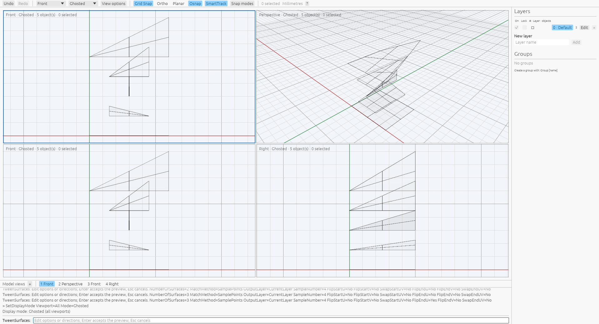
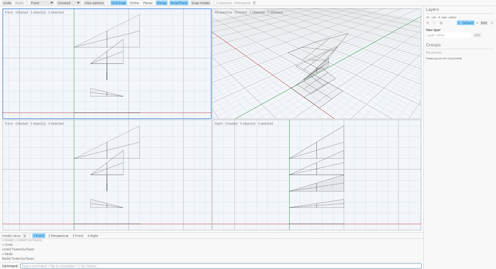

# TweenSurfaces

[Command reference](README.md) · [Rhino reference](https://docs.mcneel.com/rhino/8/help/en-us/commands/tweensurfaces.htm)

`TweenSurfaces` adds intermediate surfaces between two inputs. The current
implementation supports sampled matching (`MatchMethod=SamplePoints`) for
polynomial/rational surfaces with different degrees, counts and parameter domains.
`MatchMethod=Refit` matches degrees and knot layouts across positive rational
nets, including unequal counts. Control matching (`MatchMethod=None`) handles
equal-sized polynomial nets and compatible positive rational nets. Sources remain
unchanged.
Start the command, pick the start surface and then the end surface, edit options
or directions while viewing the preview, and press Enter to accept. Escape
cancels any phase. One preselected surface supplies the start; two preselected
surfaces open the preview directly.

```text
TweenSurfaces NumberOfSurfaces=3 MatchMethod=SamplePoints SampleNumber=6
TweenSurfaces NumberOfSurfaces=3 MatchMethod=Refit
TweenSurfaces NumberOfSurfaces=3 MatchMethod=None
TweenSurfaces Sources=<first-id>,<second-id> OutputLayer=StartSrf
TweenSurfaces Sources=<first-id>,<second-id> FlipEndU=Yes SwapEndUV=Yes
```

Explicit `Sources=` fixes script order. `FlipStartU`, `FlipStartV`, `SwapStartUV`,
and their `End` counterparts adjust correspondence without changing originals.
Swap applies before flips. Source picks retain click order, independently of
document insertion order or source groups. The same surface can be picked twice.
Native corner-click direction editing remains unfinished; use the typed direction
options while the preview is active.

Options accept `Name=value`, `Name value`, or an option name followed by its
value at the next prompt. Invalid edits retain the previous valid preview. Enter
at a value prompt keeps the current value and returns to the options phase.
View and display commands remain available during preview. Source geometry, attributes,
groups, tolerance and current-layer changes invalidate the cached result.
Preview preparation is readonly; unchanged option edits reuse the current scene.
Acceptance reuses the prepared geometry in one transaction.

The initial matching default is `SamplePoints` with `SampleNumber=10`, following
the owned fresh native settings. `SampleNumber` specifies divisions per UV axis;
there are one more stations than divisions. Both sources are evaluated at matching
normalized UV positions, blended, then interpolated as a non-rational tensor
surface with degree up to three. Knot placement uses mean chord distances on the
blended grid. Domains follow those physical chord sums and can differ between
outputs. This interpolates the grid; it does not certify a continuous exact
blend of the source surfaces. Sampling is bounded to `2..=255` divisions per axis,
matching the existing 256-station dense tensor solve limit. Source trims are not
sampled. Native sample counts above this local limit remain unsupported.

Count, matching method and sample count remember their last successful
acceptance. Cancelling the options phase discards edits to those fields. The
sample count is saved even when acceptance occurs in Refit or control matching,
so returning to SamplePoints recovers the last edited count. `OutputLayer` edits
instead take effect immediately on reaching the options phase and survive
cancellation. Cancelling during source selection does not save an inline layer
preset. Invalid input changes neither the staged options nor remembered values.
Undo/Redo does not change preferences. They belong to the application's command
registry, are shared across its documents, and reset in a fresh registry; restart
persistence remains unverified. Source IDs and direction flags are per invocation.
Use explicit options in deterministic scripts.

Counts default to one and are bounded at 4,096, with an aggregate million-control
limit. Outputs exclude sources, at fractions `i / (number + 1)`. Polynomial
preparation elevates degrees and unifies knots; output domains count common
spans. Compatible rational matching retains the first weights and scales each
control displacement by `sqrt(end_weight / start_weight)`, following measured
native data. This can extrapolate control locations. Unequal rational degrees
or counts remain rejected in control matching.

Refit prepares a common tensor basis by clamping, elevating degrees and inserting
the union of normalized interior knots with their maximum multiplicities. It then
uses the measured rational control-displacement policy above. Output UV domains
retain the end source's native intervals. This exact basis matching covers the
recorded inputs; it does not establish every native adaptive fitting policy.
The same control and output limits apply before preparation and insertion.

`OutputLayer=CurrentLayer` uses fresh default attributes and no groups.
`StartSrf` and `EndSrf` copy the corresponding attributes and group memberships.
Geometry-root text is not copied. Outputs finish unselected. Preselected sources
retain their selection through acceptance, cancellation and history; sources
picked after starting finish unselected. One Undo removes every output; Redo
restores the accepted result. Construction
is staged before insertion, and failures preserve geometry and history.

The [complete capture](../../tools/rhino_oracle/observations/tween_surfaces_command.json)
contains 22 successful owned Rhino recipes on private Xvfb under
`VibocerosOracleTweenSurfacesVerified20261008`. It retains full NURBS definitions,
81 stations per surface, properties/groups, source identity, command events
and independent Undo/Redo, plus public sampling SDK results. Eight compatible
control recipes replay degree/counts, knots, controls and weights at `1e-6` for
positions and `1e-12` for knots/weights: planes, quadratic/rational nets, different
domains, swapped rational order and output layers. Independent regressions
check extreme finite coordinates, source purity, resource rejection and history.
See [provenance](../tween-surfaces-provenance.json).

Earlier commands that changed matching options left additional source-shaped
copies: `Refit` four and `SamplePoints` two in that capture, alongside requested
tweens. The public sampling SDK returns
just the requested outputs. Both raw records and the initial investigation are
retained without normalizing these differences. Unequal-net control matching,
native corner-click editing and performance parity remain unfinished.
The registered command rejects unsupported methods. Trimmed single-face input
uses its underlying surface; trim correspondence is not implemented.

The [sampling follow-up](../../tools/rhino_oracle/observations/tween_surfaces_sampling.json)
adds 20 successful owned commands under `VibocerosOracleTweenSampling20261008`
with sample counts 2, 3 and 6. All requested command surfaces exactly equal the
public sampling SDK definitions; this run keeps the matching mode active and
produces no extra source-shaped copies. Kernel replay checks all 20 output nets
at `1e-7` for controls and `1e-8` for knots, plus all 22 earlier SDK outputs.
Command replay compares 81 UV-normalized witnesses per source/output at `1e-7`,
identity, metadata/groups and independent history. Cases cover planes, warped
and rational tensors, unequal counts/degrees/domains and source output layers.
The app regression checks that method, sample count and output count survive
command-first selection and Undo/Redo. Independent kernel checks require
analytic plane agreement at `1e-12` and reject excessive work before allocation.
See [sampling provenance](../tween-sampling-provenance.json).

The [Refit follow-up](../../tools/rhino_oracle/observations/tween_surfaces_refit.json)
adds 24 successful owned commands under `VibocerosOracleTweenRefit20261008`.
Each recipe initializes native options in the owned document, retains that
initialization record, deletes its outputs and clears history, then starts a new
command and accepts without option changes. Every accepted command produces
exactly the requested one, two or three surfaces. Native initialization still
creates extra objects; this isolates those diagnostics from accepted geometry.

Kernel replay checks all 24 accepted nets and six earlier requested Refit nets
at `1e-7` for controls and `1e-12` for knots/weights. Cases include polynomial/
rational inputs, unequal degrees/counts, swapped order, differing domains and
source-layer outputs. Command replay compares 81 UV-normalized witnesses per
source/output at `1e-7`, complete identity/properties/groups and independent
history. An independent polynomial test checks normalized parameter agreement
at `1e-12` with different degrees, U/V knot sites and multiplicities, while
preserving original sources. App tests exercise Refit options, source picking,
unequal degrees and Undo/Redo. See [Refit provenance](../tween-refit-provenance.json).
The local workflow creates the requested outputs; native option-change copies
remain unimplemented; remembered field lifetimes are described above.

The [interaction capture](../../tools/rhino_oracle/observations/tween_surfaces_interaction.json)
adds nine owned private-Xvfb recipes under
`VibocerosOracleTweenInteraction20261008`: three accepted commands and six
cancellations with zero, one or two preselected sources. Complete snapshots and
command traces retain selection and independent history. The one-preselected
macro selects that same surface as the end; native accepts it and produces copies.
App replay matches all nine outcomes, including 81 normalized witnesses per
source/output at `1e-7` and exact source/history restoration. Independent tests
check reversed pick order, readonly/cached previews, number and direction edits,
invalid values, cancellation, stale input and unrelated transaction preservation.
See [interaction provenance](../tween-interaction-provenance.json).

A private-Xvfb inspection of the wgpu/egui app checks two ordered viewport picks,
three-result preview, `FlipEndU`, Ghosted display, invalid count retention,
acceptance, Undo/Redo and cancellation. The preview viewport shows five objects
while the live layer pane still counts two sources; after acceptance/Redo it
counts five. These local images do not compare native pixels.





The [option-lifetime capture](../../tools/rhino_oracle/observations/tween_surfaces_options.json)
runs a 29-step owned sequence under `VibocerosOracleTweenOptionsVerified20261008`.
It retains initial/final native option prompts, accepted geometry, cancellations
and independent history. App replay compares every next-invocation default,
including the different layer/count save rules, rejected values and method
changes. An [eight-step follow-up](../../tools/rhino_oracle/observations/tween_surfaces_sample_memory.json)
under `VibocerosOracleTweenSampleMemory20261008` confirms that a sample count
edited before accepted Refit is revealed when returning to SamplePoints.
Command tests cover independent registries, reused documents, per-invocation
source/direction state and failed invocation admission. See
[option provenance](../tween-options-provenance.json).

The cancelled Refit edit in that sequence leaves two native source-shaped copies,
while discarding the method change for the next invocation. Those objects remain
an explicit geometry discrepancy; local readonly previews discard all staged
geometry on cancellation. The older initial investigation is retained separately.
Neither sequence establishes preference persistence across application restarts.

The JSON/Python oracle accepts `surface_tween_sampled_geometry` with
`start_surface`, `end_surface`, `number` and `sample_number`. It returns full
`surfaces` definitions in both engines and shares the same resource limits.

```sh
cargo test --release -p viboceros-geometry surface_tween
cargo test --release -p viboceros-command tween_surfaces
cargo test --release --bin viboceros tween_surfaces
python3 -m unittest tools.rhino_oracle.test_tween_surfaces tools.rhino_oracle.test_tween_surfaces_sampling tools.rhino_oracle.test_tween_surfaces_refit tools.rhino_oracle.test_tween_surfaces_interaction tools.rhino_oracle.test_tween_surfaces_options
```
