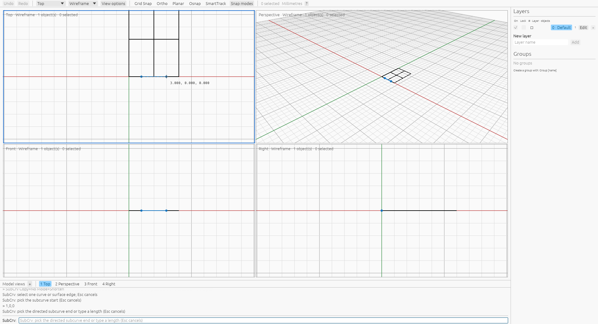

# SubCrv surface edge input

[SubCrv](commands/subcurve.md) · [Preview](subcurve-preview.md) · [Oracle](oracle.md)

SubCrv accepts one edge of a B-rep or an untrimmed NURBS surface. Preselect the
edge with Ctrl+Shift, then start `SubCrv`; alternatively start the command and
click an edge. Overlapping edge hits open the existing numbered component
chooser. Choose a number or button; Cancel dismisses the choices and leaves the
source getter active. A typed `Edge=object_id,index` also selects the source.
Indices are zero-based and belong to that object's current edge topology.

Pick two curve locations as for an ordinary source. The preview, MarkEnds and
FromMidpoint use the same extraction policy. A shortened edge always becomes a
new selected curve, including with Copy=No. The parent keeps its geometry,
identity, layer, attributes and groups. The curve inherits the parent's layer,
name, user text and groups. MarkEnds produces two unselected default points on
the current layer. Completion consumes component selection; one Undo removes
all output, and Redo restores it.

Scripts can supply the reference after the locations without selecting the parent:

```text
SubCrv 1,0,0 3,0,0 Edge=<parent-id>,0 Copy=No
SubCrv Parameter=1,3 Edge=<parent-id>,0
SubCrv Numeric=1,2,3 Edge=<parent-id>,0
```

Replace `<parent-id>` with the parent object's UUID. The last two forms use the
edge's domain, which need not match surface UV
coordinates or geometric length. These explicit forms are Viboceros extensions.
An out-of-range, unavailable or malformed edge reference fails without document
edits. Interactive references capture an immutable parent snapshot and tolerance;
a changed parent, hidden/locked source or changed tolerance releases the pending
interval and asks for a fresh selection. Stale preselection is rejected before
starting. NURBS surface boundaries are resolved through the same surface-face
construction as component picking. Preview caches that conversion as well as
closest parameters and extracted curves; B-rep edges remain borrowed.

The October 7, 2026 private-Xvfb capture used Rhino 8.32.26160.13001 with settings
scheme `VibocerosOracleSubcurveEdgesFinal20261007`. Eleven owned recipes use the
public SDK to preselect one physical edge and execute the public SubCrv command.
All succeed: box edges, a planar surface boundary and circular cylinder edges;
forward/backward point entry, explicit Copy choices, MarkEnds and FromMidpoint.
The [raw records](../tools/rhino_oracle/observations/subcurve_edge.json) retain full
parent definitions, selected components, macros, getter history, command events,
output definitions, metadata and independent Undo/Redo snapshots. Nine output
curves have 297 stations; two marker cases create four points. Application replay
checks stations and directed endpoints at `1e-6`, metadata, parent snapshot
identity and complete output restoration. The surface replay additionally uses
an independent native Rust NURBS surface source. Command tests cover typed
references, Copy=No, domain inputs and atomic failures; UI tests cover ambiguity,
cancellation, preview purity and stale sources.

A fresh private-Xvfb inspection of the production wgpu/egui application confirms
command-first edge selection, curve and marker-only previews, marker acceptance,
and Copy=No curve acceptance with Undo/Redo while retaining the surface. The screenshot below records a pending
Copy=No edge interval, with one unchanged source and no selected objects.



This capture measures native component preselection, not Rhino's command-first
mouse picker. The local picker has application routing and real pointer-event
tests for both ordinary curves and surface edges. Arbitrary
trimmed edges, numeric edge getter behavior, seam ties, nested UV edge inputs,
continuous locus certificates and relative performance remain unverified.
See [capture provenance](subcurve-edge-provenance.json).

```sh
cargo test --release --bin viboceros subcurve_edge
cargo test --release -p viboceros-command subcurve_edge
python3 -m unittest tools.rhino_oracle.test_subcurve_edge
```
