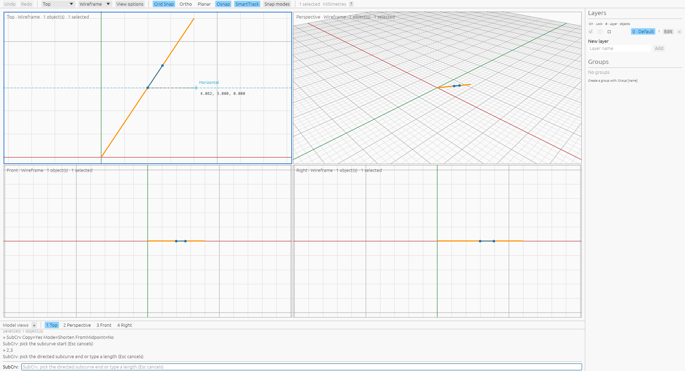

# SubCrv viewport preview

[SubCrv](commands/subcurve.md) · [Direction](subcurve-direction.md) · [Closed numeric input](subcurve-direction-confirmation.md)

After picking the start, moving the cursor displays the prospective subcurve in
blue with its two endpoints. The same model-space geometry appears in every
viewport, including Wireframe, Shaded and Ghosted. MarkEnds displays the endpoint
markers without the blue curve. The original object remains in the document
until acceptance; hovering adds no objects, selection changes or history entries.



Point, pending numeric, locked-side and FromMidpoint previews use the same command
policies as completion. Closed point intervals retain their source direction;
open point intervals retain source orientation. Pending numeric confirmation
chooses its candidate from the current hover. Invalid or unavailable intervals
clear the overlay, and cancellation or completion drops the preview. Moving to
the command bar keeps the last valid hover so options can be changed there.
Nested UV source getters use the same preview before their parent transaction.

Each prompt caches its closest parameter and derived curve by immutable source
snapshot, input parameters and document tolerance. Unchanged inputs and viewport
navigation reuse shared geometry. Copy and MarkEnds display changes avoid solving
the curve again; source edits, geometry parameters and tolerance invalidate the
cache. Failed constructions are cached too. A changed hover requests another
paint so all viewports receive the updated result without accepting a point.

Tests compare ten pending previews with the existing native confirmed results,
including 330 output stations and endpoints at `1e-6`. They check snapshot
identity, attributes, selection and absent history, repeated cache reuse,
MarkEnds, Copy, locked-side rejection, midpoint symmetry and cancellation.
A CPU egui test checks curve/marker overlays in four views and three modes,
including inactive input and no hovered viewport. A private-Xvfb application
inspection through the production wgpu/egui renderer confirmed the four-view
preview, marker-only mode and complete removal after Escape; the image above is
from that inspection.

This is a local preview validation against saved native command outputs, not a
fresh Rhino preview measurement or pixel-style compatibility claim. General
closed-chart policy, edge references, reactive History and continuous locus
certification retain their existing limits.

```sh
cargo test --release --bin viboceros subcurve_preview
cargo test --release --bin viboceros subcurve_curve_and_endpoint_overlays
```
